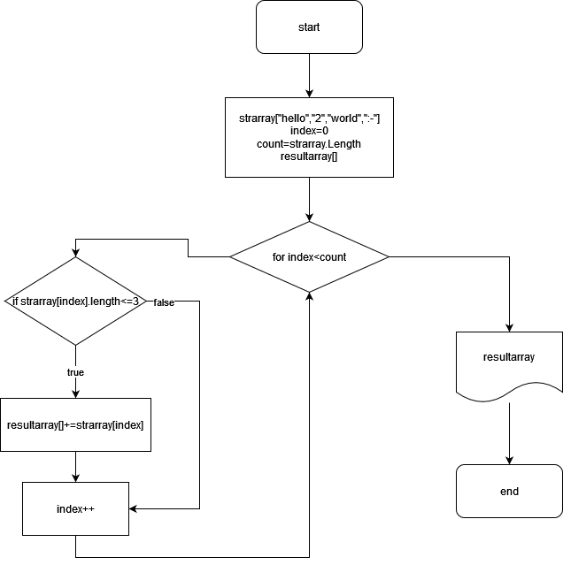

# Проверочная работа

## ЗАДАЧА 
*Написать программу, которая из имеющегося массива строк формирует массив строк, меньше или равна 3 символам. Первоночальный массив вводится с клавиатуры или задается на старте.выполнения алгоритма.*

## Решение 
Для решения данной  задачи я придумал блок-схему, которая мне поможет написать код.

